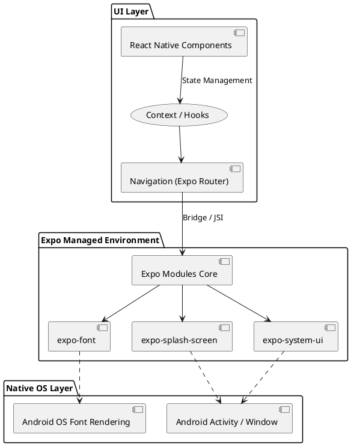
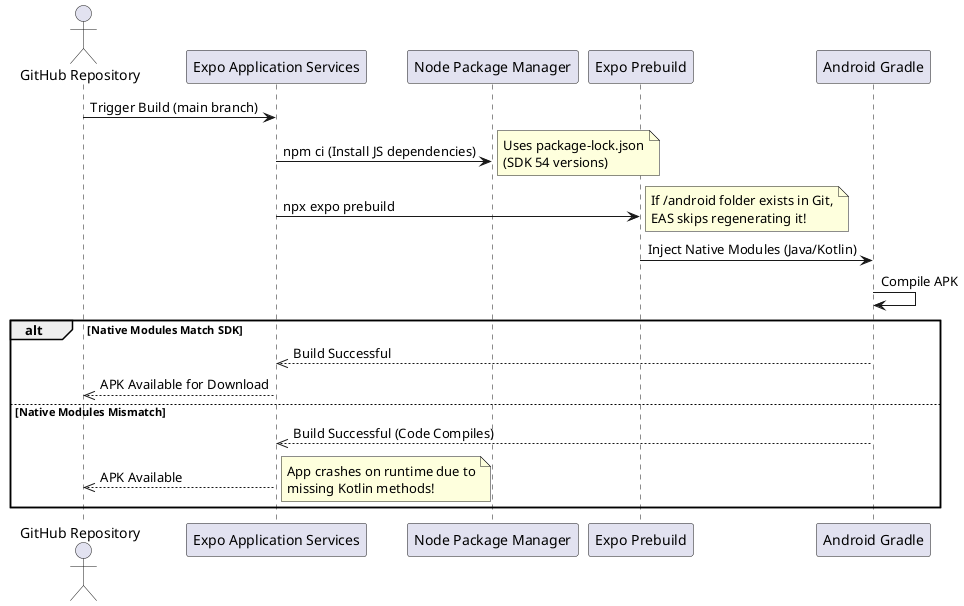
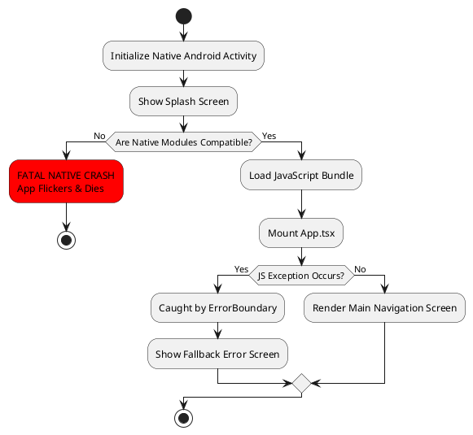
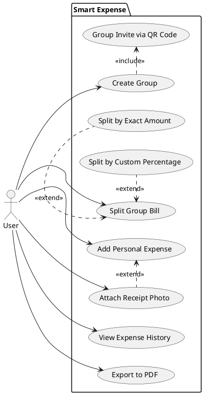

# Smart Expense UML Diagrams

These diagrams provide a high-level visual overview of the system architecture, build process, and core application flows. You can copy the code blocks below and paste them into [PlantText.com](https://www.planttext.com/) or [PlantUML.com](https://plantuml.com/plantuml/) to instantly generate the visual diagrams.

## 1. System Architecture Diagram

This diagram illustrates how the different layers of the React Native and Expo ecosystem interact with the native device OS.

## 2. EAS Build Flow (Prebuild Process)

This sequence diagram explains the exact process of how the standalone APK is built in the cloud and how Native Mismatches (like the one we fixed) occur.

## 3. Application Boot & Error Boundary Flow

This diagram shows what happens when the user opens the application, and how the `ErrorBoundary` catches JavaScript errors versus how Native crashes bypass it.

## 4. User Interaction (Use Case) - Planned Features

This use case diagram maps out the core actions a user can take inside the application, including the upcoming roadmap features.

